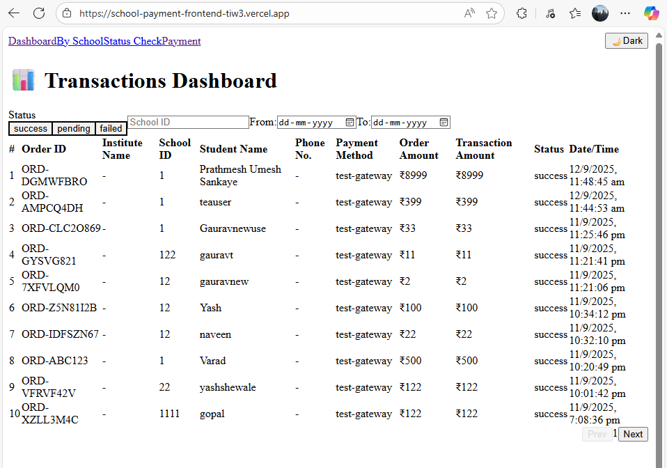
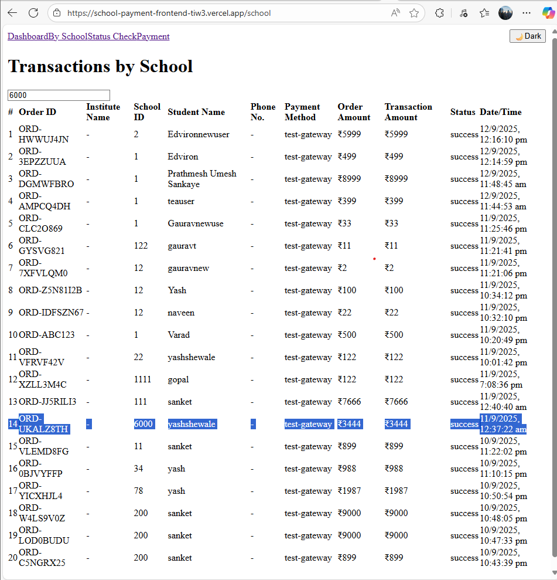

1. 🎓 School Payment & Dashboard (Frontend)

A responsive web application to manage and view school payments, built with **React + Vite + TypeScript + TailwindCSS**.  
This frontend integrates with the backend APIs to display transactions, check payment status, and create new payments.


## 🚀 Live Demo
🔗 [View Deployed App](https://school-payment-frontend-tiw3.vercel.app)


## 🛠️ Tech Stack Used
- React + Vite + TypeScript
- TailwindCSS (styling)
- Axios (API calls)
- React Router (routing)
- Deployed on Vercel


## 📂 Features

### 1. Dashboard (Transactions Overview)
-This is the main landing page after login. It displays a table of all transactions fetched from the backend.

Each row shows important details:

-collect_id, school_id, gateway, order_amount, transaction_amount, status, custom_order_id

-Users can search transactions and view only what they need.

-Filters: Users can filter by
1.Transaction status (success, pending, failed)
2.Specific school ID
3.A custom date range

Sorting: Transactions can be sorted in ascending/descending order by date, amount, or status.
This page acts as a financial dashboard for schools to get an overview of all payments at once.


### 2. Transactions by School
- Fetches transactions for a specific school_id  
- Allows selecting school via dropdown/search bar  


### 3. Transaction Status Check
- Enter `custom_order_id` and check real-time payment status  


### 4. Create Payment
-This page provides a form for initiating a new payment.

-Fields include: Order ID, School ID, Trustee ID, Student Name, Student ID, Email (optional), and Amount.

-After filling, the user clicks Create Payment.

-The system generates a new payment order and redirects to the payment gateway (with amount & student details).

-Once payment is done, user can come back and track status via Transaction Status Check.
This page makes the system interactive by not just showing data, but actually letting users initiate transactions.


## 🖼️ Screenshots

> 📌 Add screenshots here (place them inside `/public/screenshots/` folder and reference in markdown)

- **Dashboard Page**  
  

- **Create Payment Page**  
  

- **Transaction Status Page**  
  


5. Dark Mode Toggle (Bonus UI Feature)

The UI has a 🌙 Dark/Light mode toggle, allowing users to switch themes for better readability and personal preference.


## ⚙️ Getting Started (Local Setup)

1. Clone the repo  
   ```bash
   git clone https://github.com/Prathmesh5-alt/school-payment-frontend.git
   cd school-payment-frontend
